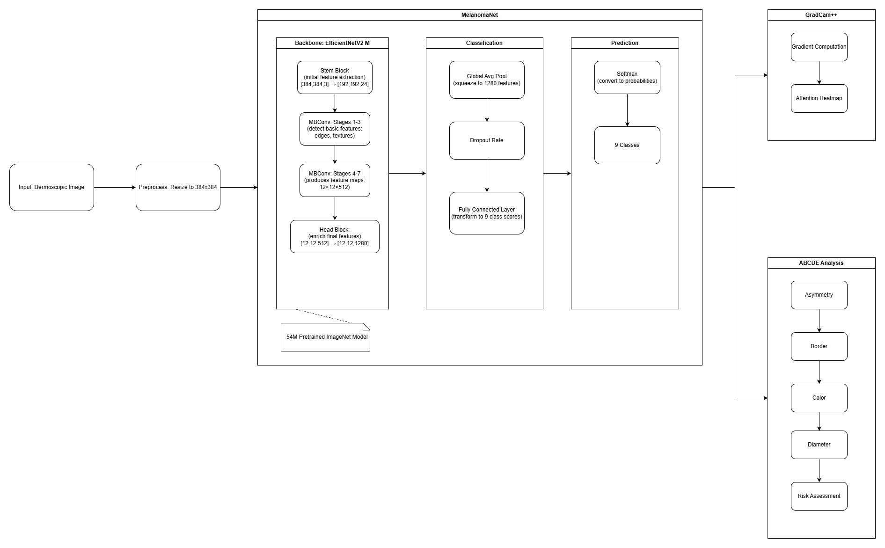
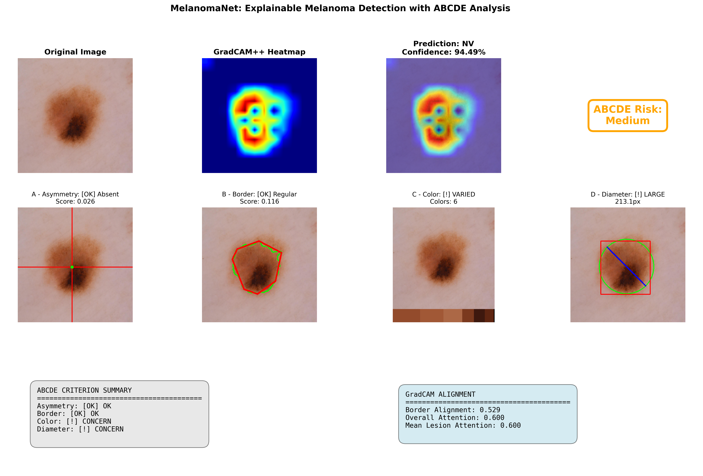
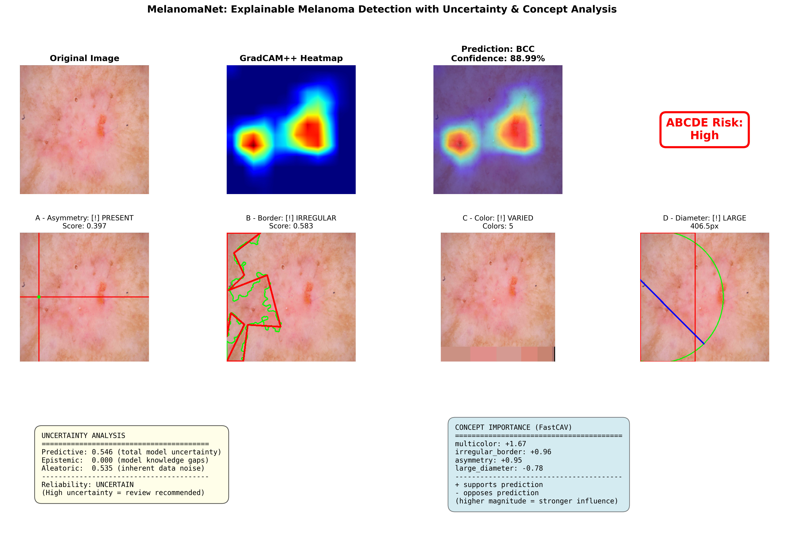
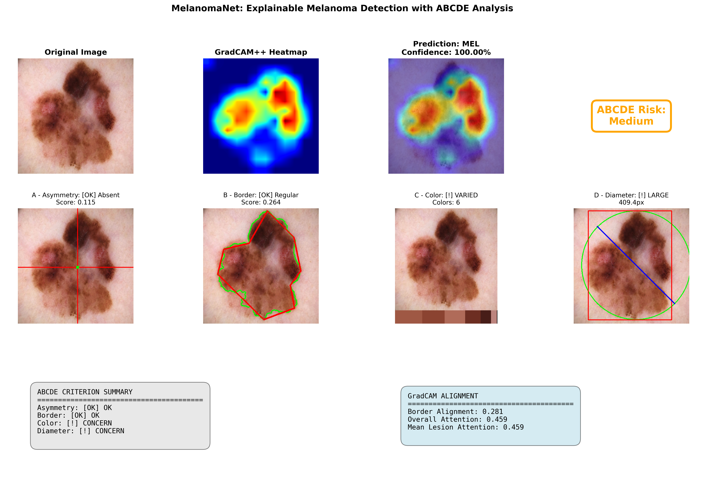
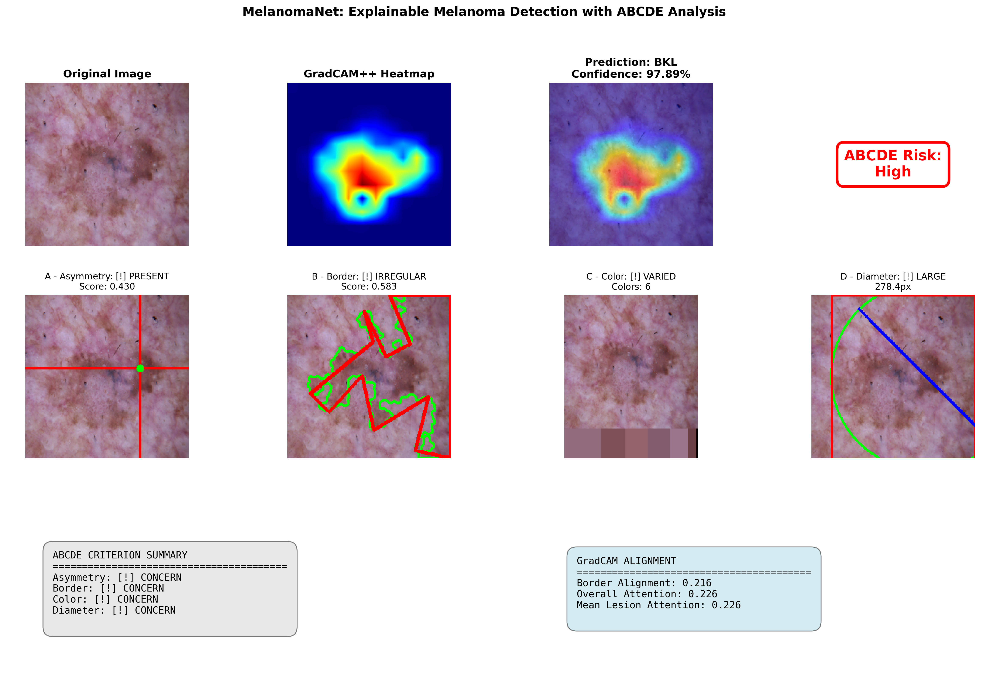
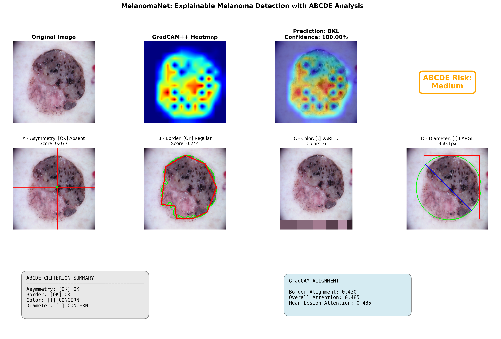

# MelanomaNet: Explainable Skin Lesion Classification

Explainable deep learning system for multi-class skin lesion classification with ABCDE criterion validation using attention-based visualization (GradCAM++).

## Features

- **Multi-class skin lesion classification** across all 9 ISIC 2019 diagnostic categories:
  - MEL (Melanoma), NV (Nevus), BCC (Basal cell carcinoma), AK (Actinic keratosis)
  - BKL (Benign keratosis), DF (Dermatofibroma), VASC (Vascular), SCC (Squamous cell carcinoma), UNK (Unknown)
- **EfficientNet V2 Medium** backbone with high-resolution (384x384) input for maximum detail preservation
- Support for EfficientNet V2 architectures (S/M/L)
- GradCAM++ attention visualization for model explainability
- **Novel ABCDE criterion analysis with automated feature extraction:**
  - **A**symmetry detection and quantification
  - **B**order irregularity measurement
  - **C**olor variation analysis using K-means clustering
  - **D**iameter calculation
  - **E**volution tracking (not implemented - requires temporal images)
- **GradCAM-ABCDE alignment metrics** to validate model attention
- Class imbalance handling (weighted loss, focal loss)
- Comprehensive clinical interpretability reports

## Installation

```bash
# Install dependencies
pdm install

# If PDM is not installed then install it via pip:
pip install --user pdm
```

## Dataset Preparation

### ISIC 2019

1. Download from: <https://challenge.isic-archive.com/data/>
2. Extract to `data/isic_2019/`:

```text
data/isic_2019/
├── train/
│   ├── ISIC_0000001.jpg
│   └── ...
├── test/
│   ├── ISIC_0001001.jpg
│   └── ...
└── ISIC_2019_Training_GroundTruth.csv
```

## Usage

### Training

```bash
pdm run train
# Or: python scripts/train.py --config config.yaml
```

### Evaluation

```bash
pdm run eval
# Or: python scripts/eval.py --checkpoint checkpoints/best_model.pth --config config.yaml
```

### Inference

```bash
# Run inference
python scripts/infer.py --checkpoint checkpoints/best_model.pth \
                        --input path/to/image.jpg \
                        --config config.yaml
```

### Resume Training from Checkpoint

```bash
# Resume from last checkpoint
python scripts/train.py --config config.yaml --resume ./checkpoints/last_checkpoint.pth

# Resume from specific epoch
python scripts/train.py --config config.yaml --resume ./checkpoints/checkpoint_epoch_10.pth
```

## Configuration

Edit [config.yaml](config.yaml) to customize:

- Dataset path and splits
- **Model architecture**: Choose from `efficientnet_v2_s`, `efficientnet_v2_m`, `efficientnet_v2_l`
- **Input resolution**: Default 384x384 for high-detail medical imaging (configurable: 224, 384, 480, 512, 640)
- Training hyperparameters (batch size optimized for available GPU memory)
- Augmentation settings
- GradCAM parameters
- ABCDE analysis thresholds (automatically scaled with image resolution)

## Model Architecture



MelanomaNet consists of three main components:

### 1. Feature Extraction (EfficientNet V2-M Backbone)

- **Backbone**: EfficientNet V2 Medium (54M params, 1280 features)
  - Also supports: V2-S (22M params), V2-L (119M params)
- **Input Resolution**: 384×384 RGB images (3x more pixels than standard 224×224)
- **Pretrained**: ImageNet-1K weights for transfer learning
- **Architecture**: 7 MBConv (Mobile Inverted Bottleneck Convolution) stages with progressive feature extraction

### 2. Classification Head

- **Global Average Pooling**: Reduces spatial dimensions (12×12×1280 → 1280)
- **Dropout**: 0.3 regularization to prevent overfitting
- **Linear Classifier**: 1280 → 9 classes with softmax activation
- **Output**: Probabilities for MEL, NV, BCC, AK, BKL, DF, VASC, SCC, UNK

### 3. Explainability & Interpretability

- **GradCAM++**: Attention visualization showing which image regions influenced the prediction
- **ABCDE Analysis**: Clinical criterion extraction (Asymmetry, Border, Color, Diameter)
- **Alignment Metrics**: Validates that model attention aligns with clinical features

### Training Configuration

- **Data Augmentation**: Geometric transforms (flips, rotation, affine) + color jittering (brightness, contrast, saturation, hue) + ImageNet normalization
- **Class Imbalance**: Weighted cross-entropy loss with optional focal loss; stratified train/val/test split
- **Optimization**: Mixed precision training (AMP), cosine annealing LR scheduler, AdamW optimizer
- **Checkpointing**: Saves best model by F1 score and last epoch for resumption
- **Metrics**: Accuracy, weighted precision/recall/F1, per-class classification reports, confusion matrices

### ABCDE Clinical Interpretability

The system provides automated extraction and quantification of clinical ABCDE criteria for melanoma detection:

- **Asymmetry (A)**: Quantifies lesion symmetry along horizontal/vertical axes (score 0-1)
- **Border (B)**: Measures contour irregularity and compactness
- **Color (C)**: Identifies distinct colors using K-means clustering
- **Diameter (D)**: Calculates maximum lesion diameter in pixels
- **Evolution (E)**: Not implemented - requires temporal images
- **GradCAM Alignment**: Validates that model attention aligns with clinical ABCDE features

## Results

Sample inference results demonstrating GradCAM++ attention visualization and ABCDE clinical analysis:

### Sample 1: ISIC_0034335



### Sample 2: ISIC_0034338



### Sample 3: ISIC_0034376



### Sample 4: ISIC_0034390



### Sample 5: ISIC_0034500



Each result shows:

- Original dermoscopic image
- GradCAM++ attention heatmap highlighting regions of interest
- Overlay visualization with prediction and confidence
- ABCDE risk assessment (Low/Medium/High)
- Individual ABCDE criterion analysis with visualizations
- GradCAM-ABCDE alignment metrics

## Citation

```bibtex
@misc{melanomanet2025,
  title={MelanomaNet: Explainable Skin Lesion Classification},
  author={Ilyosbekov, Sukhrob},
  year={2025}
}
```

## License

This project is licensed under the MIT License - see the [LICENSE](LICENSE) file for details.
